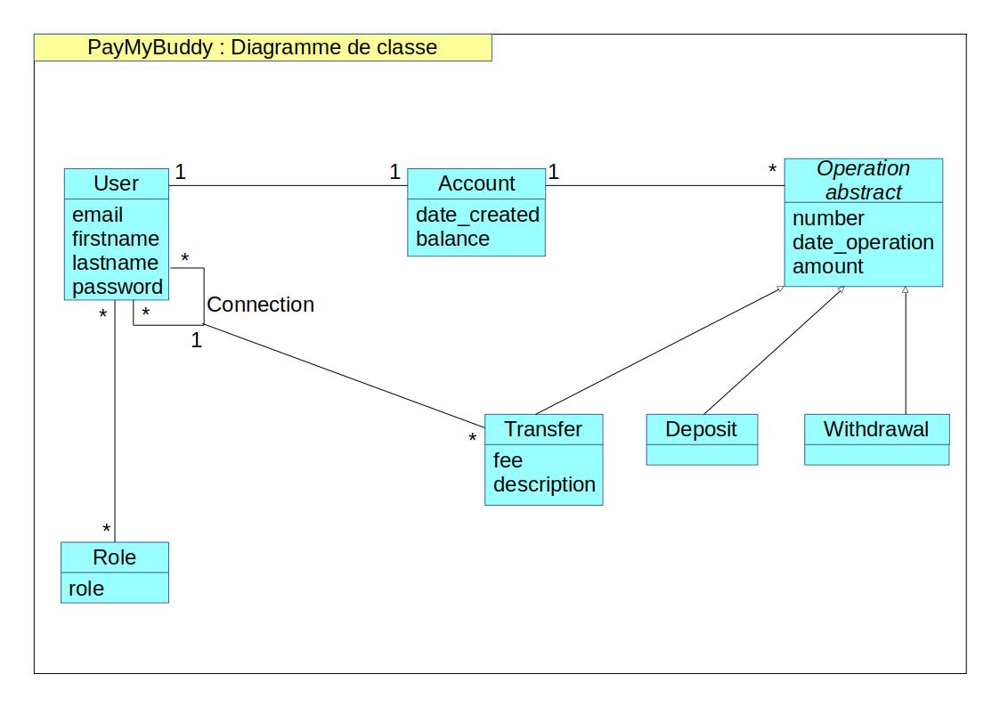
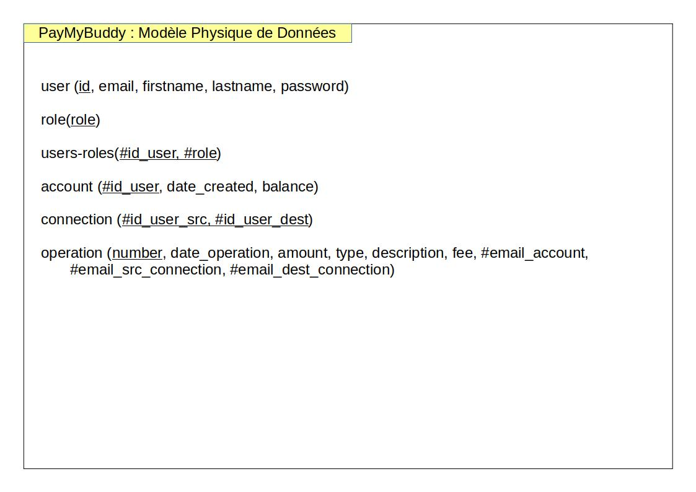

# PayMyBuddy

PayMyBuddy is an application which simplify money transfers.

With only one click, you can pay your friends and manage your money.

### Prerequisites
- Java 1.8
- Maven 3.6.0
- MySQL 5.7.36

### Installing
A step by step series of examples that tell you how to get an environment running:

1.Install Java:

https://docs.oracle.com/javase/8/docs/technotes/guides/install/install_overview.html

2.Install Maven:

https://maven.apache.org/install.html

3.Install MySql:

https://dev.mysql.com/downloads/mysql/

After downloading the mysql installer and installing it, you will be asked to configure the password for the default `root` account.

### Creating database
Post installation of MySQL, Java and Maven, you will have to set up the tables and data in the database.

For this, please run the sql commands present in the `database.sql` file under the `resources` folder in the code base.

### Importing the project
Import the project in your favorite IDE.

### Settings
Open `config/application.properties` and edit all `spring.datasource...` properties with your database settings.

### Testing
Go to the root repository of the project:

Execute `mvn verify` to run unit and integration tests.

### Running App
Go to the `target` repository and run the executable:

`java -jar PayMyBuddy-0.0.1-SNAPSHOT.jar --spring.config.location=../config/application.properties`.

Registration step:

In your browser, go to `http://localhost:8080/user/registration` and fill the form.

Login step:

Click the `Login` button and login.

And enjoy !

### Documentation
Go to the root repository of the project:

Execute `mvn site` to generate the documentation.

In your browser, open `PayMyBuddy/target/site/index.html`.

Model class diagram:

Physical data model:

